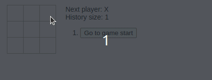
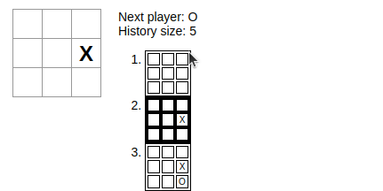
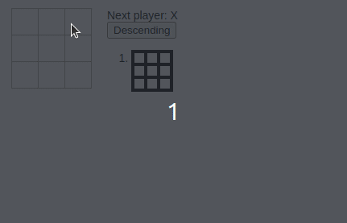
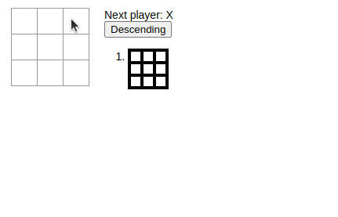

# TIC TAC TOE

## Motivation

This project was created to practice react front end skills. The full tutorial to develop this game using react was provided by reactjs.org at this [link](https://legacy.reactjs.org/tutorial/tutorial.html), please check it out if you want to build your own tic tac toe using react. The tutorial introduces several react functionalities, tools and good practices, like using **state** attribute to let the react js engine to know whenever to update an element in the DOM. The main goal of the tutorial is to create a game as simple as possible, buuut my goal here is to test my front-end skills deeply (this time using react) so I decided to improve the game.

## Development Steps

### 0. Basic Game

First of all I created the game using the reactjs.org [provided tutorial](ttps://legacy.reactjs.org/tutorial/tutorial.html), the result is a simple TIC TAC TOE game, with the most basic appearance.



To make the things funnier I decided to create some improvement tasks and then work on then one by one. The tutorial by it self already suggest a couple of new features to challenge the developers, here they are:

1. Display the location for each move in the format (col, row) in the move history list.
2. Bold the currently selected item in the move list.
3. Rewrite Board to use two loops to make the squares instead of hardcoding them.
4. Add a toggle button that lets you sort the moves in either ascending or descending order.
5. When someone wins, highlight the three squares that caused the win.
6. When no one wins, display a message about the result being a draw.

Beside these additional tasks I decided to create some challenging tasks by myself, here they go:

7. Apply a beautiful CSS design instead of using a basic one.
8. Use icons instead of simple X and O.
9. Display time travel like frames instead of simple (col, row).
10. Trace a line over the game indicating the line that won the game.
11. Make a fun animation with a congratulation warning on winning.

### 1. Improve history display

I removed the history buttons and replaced then by tables, each table is displaying an old game state stored in the history. I applied some extra css to display legible tables.


### 2. Bold selected history

I applied conditional css based on the current history selected state.



### 3. Use loops to generate squares

I removed the static logic generating the Squares and replace it with a logic using two loops, one for rows and one for cols. Look at the snippets:

Old static logic:

```
<div className="board-row">
    {this.renderSquare(0)}
    {this.renderSquare(1)}
    {this.renderSquare(2)}
</div>
<div className="board-row">
    {this.renderSquare(3)}
    {this.renderSquare(4)}
    {this.renderSquare(5)}
</div>
<div className="board-row">
    {this.renderSquare(6)}
    {this.renderSquare(7)}
    {this.renderSquare(8)}
</div>
```

Dynamic new logic:

```
function renderRows(){
    const rows = []
    for (let i = 0; i < 3; i++) {
        const cols = []
        for (let j = 0; j < 3; j++) {
            const squareIndex = j + 3*i
            cols.push(
                <Square
                    key={squareIndex}
                    value={this.props.squares[squareIndex]}
                    onClick={() => this.props.onClick(squareIndex)}
                />
            )
        }
        rows.push(
            <div key={i} className="board-row">
                {cols}
            </div>
        )
        
    }
    return rows
}
```

### 4. Sort moves

I added one more attribute into the game state attribute, the **ascending** attribute, then I created a callback function in a button to toggle this new state property. To change the order from ascending to descending I just used the function [Array.prototype.reverse()](https://developer.mozilla.org/en-US/docs/Web/JavaScript/Reference/Global_Objects/Array/reverse) and to change the automatic numbers inserted by the *ol* html tag I used the property [*reversed*](https://www.w3schools.com/tags/att_ol_reversed.asp). See the result:




### 5. Highlight victory

To develop this feature I had to do some refactoring. First thing, the function that calculates the end of the game, the *gameOver* function, implemented inside *game.js* file was returning only the winner´s label, but now we need to know witch squares caused the victory, so I incremented the *gameOver* function return, passing this new information from *Game* to *Board* component and then rendering the squares on the board using a new class named *Highlight* for that squares that were the winning cause. See the result:



----------------------

Check out the code.
Enjoy :)
